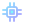
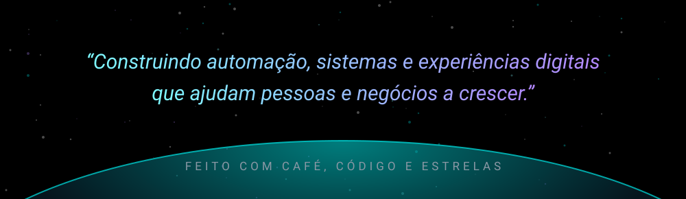

 

  

##  Sobre mim

Fala! Eu sou o **Eduardo Bottino**, **24 anos**, do **Brasil** e **Desenvolvedor Full-Stack**.

Comecei com automações e chatbots. Hoje mantenho um pequeno universo de empresas, comunidades e sistemas, todos construídos com o mesmo objetivo: **automatizar, conectar e fazer pessoas e negócios crescerem**.

| | Cargo | Onde |
|:-:|:--|:--|
|  | **CEO & Dev** | **[C.IAutomatiza](https://ciautomatiza.com.br)**: automação inteligente, SaaS e segurança |
|  | **CTO & Dev** | **[PixelCraft Studio](https://pixelcraft-studio.com/)**: sistemas modernos e experiências digitais |
|  | **Criador** | **Pixel-Dev** · **[ARISE Gaming](https://arise.discloud.app/)** · **VIRTUS** · **[Gamelandia](https://discord.gg/gamelandia)** |

Sou uma pessoa aventureira: gosto de jogar, explorar tecnologias novas, caçar bugs e comportamentos inesperados no Discord, e estou sempre pronto para ajudar e evoluir.

##  Ecossistema

Tudo o que construo orbita ao redor da **C.IAutomatiza**. Cada planeta abaixo é um projeto:

  

##  Projetos

### Empresas

A empresa-mãe do ecossistema. Nasceu com chatbots e com o SaaS **NeuralFlow** (pré-atendimento, captação de leads e fluxos automatizados de WhatsApp) e hoje reúne automação, produtos digitais e o sistema de segurança **VIRTUS**.

`Automação` `SaaS` `WhatsApp` `Dashboards` `APIs` `Segurança`

 

Estúdio focado em criar e evoluir plataformas modernas: sistemas de suporte e tickets, dashboards de comunidade, soluções para Discord, sites e ferramentas de automação, tudo com identidade pixel-style.

`Discord` `Web` `Tickets/SAC` `Dashboards` `UX`

### Projetos autorais

Comunidade para jogadores de **League of Legends**, com ecossistema próprio: **Bot** para Discord, **site com dashboard** e **APK**, todos integrados à **API da Riot** para dados de jogadores, partidas personalizadas, eventos e jogos em grupo.

`League of Legends` `Riot API` `Bot` `Dashboard` `Android`

 

Servidor e comunidade completa para **jogos e jogadores entusiastas**: eventos, partidas, bate-papo e muita diversão.

`Comunidade` `Discord` `Jogos` `Eventos`

 

Meu sistema de segurança associado à **C.IAutomatiza**. Conta com um **site de interação** e uma **galáxia** interativa que reúne o acesso a todos os sites do projeto.

`Segurança` `Web` `Interação`

 

Sistema automatizado de **aplicações, bots e servidores para Discord**: tickets, logs e moderação, automod, giveaways, economia, jogos, gestão de cargos e dashboards de servidor.

`Discord` `Automação` `Bots` `Moderação` `Economia`

##  Stack

**Linguagens e Front-end** 

**Back-end e Bancos de dados** 

**Integrações e Plataformas** 

**Ferramentas** 

##  Painel de bordo

  

<picture>
  <source media="(prefers-color-scheme: light)" srcset="https://raw.githubusercontent.com/eoBottino/eoBottino/output/github-snake.svg">
  
</picture>

##  Contato

Quer conversar, montar um projeto ou entrar na comunidade? Manda um sinal.

 

  

  

**Brasil** · contatobottino@gmail.com · Discord: `eubottino`

##  English

<b>Click to expand the English version</b>

 

I'm **Eduardo Bottino**, 24, from **Brazil**, and a **Full-Stack Developer**.

- **CEO & Dev at [C.IAutomatiza](https://ciautomatiza.com.br)**: intelligent automation, SaaS and security (it started with chatbots and the NeuralFlow SaaS for lead capture and WhatsApp flows).
- **CTO & Dev at [PixelCraft Studio](https://pixelcraft-studio.com/)**: modern systems, community tools, dashboards and scalable digital experiences.
- **Creator of my own projects:**
  - **Pixel-Dev**: automated system for applications, bots and Discord servers.
  - **[ARISE Gaming](https://arise.discloud.app/)**: a League of Legends community with a Discord bot, a website with dashboard and an Android APK, all powered by the Riot API (custom games, events and group matches).
  - **VIRTUS**: a security system tied to C.IAutomatiza, with an interaction website and a galaxy hub that links all of its sites.
  - **[Gamelandia](https://discord.gg/gamelandia)**: a complete server and community for gamers and gaming enthusiasts.

I'm an adventurer by nature: I love gaming, exploring new tech, hunting bugs and unusual behaviors on Discord, and I'm always ready to help, learn and build something better.

**Portfolio:** [ciautomatiza.com.br/dev/portfolio](https://ciautomatiza.com.br/dev/portfolio)

 

