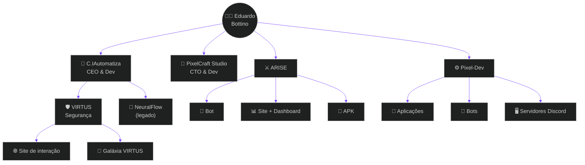

  

## 👨‍🚀 Sobre mim

Fala! Eu sou o **Eduardo Bottino**, **24 anos**, do **Brasil 🇧🇷** e **Desenvolvedor Full-Stack**.

Minha jornada começou com automações e chatbots e hoje virou um pequeno universo de produtos, comunidades e sistemas:

| 🧭 Missão atual | Onde |
|:--|:--|
| 👑 **CEO & Dev** | **[C.IAutomatiza](https://ciautomatiza.com.br)** — automação inteligente, SaaS e segurança |
| 🛰️ **CTO & Dev** | **PixelCraft Studio** — sistemas modernos, comunidades e experiências digitais |
| 🧪 **Criador** | **Pixel-Dev · ARISE · VIRTUS** — meus projetos autorais |

Sou uma pessoa aventureira: curto jogar, explorar tecnologias novas, caçar bugs e comportamentos inesperados no Discord, e estou sempre pronto para ajudar e evoluir. 🎮🐞

## 🌌 Ecossistema

Tudo o que construo orbita ao redor da **C.IAutomatiza**:

## 🚀 Projetos

<table>
<tr>
<td width="50%" valign="top">

### 🧠 C.IAutomatiza
**CEO & Dev** · Automação inteligente e soluções digitais.

Começou com chatbots e o SaaS **NeuralFlow** (pré-atendimento, captação de leads e fluxos de WhatsApp) e hoje é a empresa-mãe do meu ecossistema.

`Automação` `SaaS` `WhatsApp` `Dashboards` `APIs`

</td>
<td width="50%" valign="top">

### 🎨 PixelCraft Studio
**CTO & Dev** · Estúdio de sistemas e experiências digitais.

Criação e evolução de plataformas modernas: suporte e tickets, dashboards de comunidade, soluções para Discord, sites e ferramentas de automação com identidade *pixel-style*.

`Discord` `Web` `Tickets/SAC` `Dashboards` `UX`

</td>
</tr>
<tr>
<td width="50%" valign="top">

### 🛡️ VIRTUS
**Sistema de segurança** associado à C.IAutomatiza.

Conta com um **site de interação** e uma **galáxia** interativa para navegar entre os sites e serviços do projeto.

`Segurança` `Web` `Interação`

</td>
<td width="50%" valign="top">

### ⚔️ ARISE
**Comunidade de jogadores de League of Legends.**

Ecossistema completo: **Bot** para Discord, **site com dashboard** e **APK**, integrados à **API da Riot** para dados de jogadores, partidas personalizadas, eventos e jogos em grupo.

`League of Legends` `Riot API` `Bot` `Dashboard` `Android`

</td>
</tr>
<tr>
<td colspan="2" valign="top">

### ⚙️ Pixel-Dev
**Sistema automatizado** para **aplicações, bots e servidores de Discord**: tickets, logs e moderação, automod, giveaways, economia, jogos, cargos e dashboards de servidor.

`Discord` `Automação` `Bots` `Moderação` `Economia`

</td>
</tr>
</table>

## 🛠️ Stack

**Linguagens & Front-end** 

**Back-end & Bancos de dados** 

**Integrações & Plataformas** 

**Ferramentas** 

## 📊 Painel de bordo

 

 

 

## 📡 Contato

  

📍 **Brasil** &nbsp;·&nbsp; 📧 contatobottino@gmail.com &nbsp;·&nbsp; 💬 Discord: `eubottino`

 

🎮 Gaming &nbsp;•&nbsp; 🧭 Explorando ideias &nbsp;•&nbsp; 🐞 Caçando bugs &nbsp;•&nbsp; 💬 Ajudando pessoas &nbsp;•&nbsp; 🚀 Construindo projetos escaláveis

## 🇺🇸 English

<b>🛰️ Click to expand the English version</b>

 

### 👨‍🚀 About me

I'm **Eduardo Bottino**, 24, from **Brazil**, and a **Full-Stack Developer**.

- 👑 **CEO & Dev at [C.IAutomatiza](https://ciautomatiza.com.br)**: intelligent automation, SaaS and security solutions (started with chatbots and the NeuralFlow SaaS).
- 🛰️ **CTO & Dev at PixelCraft Studio**: modern systems, community tools, dashboards and scalable digital experiences.
- 🧪 **Creator of my own projects:**
  - **Pixel-Dev**: automated system for applications, bots and Discord servers.
  - **ARISE**: League of Legends community with a Bot, a website with dashboard and an Android APK powered by the Riot API (custom games, events, group matches).
  - **VIRTUS**: security system tied to C.IAutomatiza, with an interaction website and a galaxy hub linking all its sites.

I'm an adventurer by nature: I love gaming, exploring new tech, hunting bugs and unusual behaviors on Discord, and I'm always ready to help, learn and build something better.

**Portfolio:** [ciautomatiza.com.br/dev/portfolio](https://ciautomatiza.com.br/dev/portfolio)

 

  

